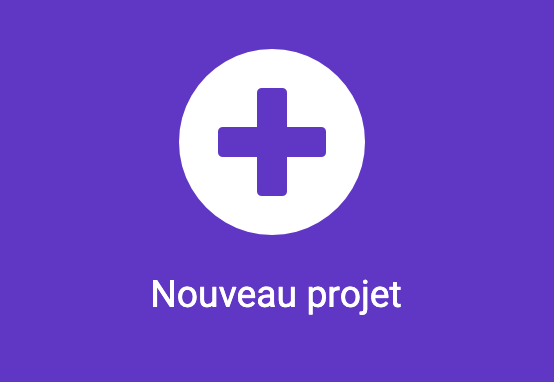

## Une mélodie simple

Crée ta première musique !

\--- task ---

Ouvre l'éditeur MakeCode sur [makecode.microbit.org](https://makecode.microbit.org){:target="_blank"}.

\--- /task ---

### Premier projet sur micro:bit ?

[[[makecode-tour]]]

\--- task ---

### Créer ton projet

Crée et nomme ton projet :

Clique sur le bouton **Nouveau projet**.



\--- /task ---

\--- task ---

Donne un nom à ton nouveau projet (par exemple 'Notre Club') et clique sur **Créer**.

\--- /task ---

\--- task ---

### Créer une mélodie

Dans le menu `Musique`{:class="microbitmusic"}, fais glisser le bloc `jouer la mélodie ... au tempo 120 (bpm) [jusqu'à la fin]`{:class="microbitmusic"} et place-le à l'intérieur du bloc `toujours`{:class="microbitbasic"}.

```microbit
basic.forever(function () {
    music.play(music.stringPlayable("- - - - - - - - ", 120), music.PlaybackMode.UntilDone)
})
```

\--- /task ---

\--- task ---

Clique sur la mélodie pour ouvrir l'éditeur.

\--- /task ---

\--- task ---

Passe à la Galerie et choisis une mélodie.

Consulte le motif de la mélodie dans l'éditeur.

\--- /task ---

\--- task ---

Clique sur le bouton lecture ▶️ pour écouter la mélodie choisie.

Consulte le motif de la mélodie dans l'éditeur.

\--- /task ---

\--- task ---

### Écouter et accorder

**Test**

- Essaie différentes mélodies et écoute les changements
- Change les notes pour changer la mélodie

\--- /task ---

\--- task ---

Continue à expérimenter jusqu'à entendre une mélodie que tu aimes.

\--- /task ---

\--- task ---

Lorsque tu modifies un bloc de code dans le panneau de l'éditeur de code, le simulateur redémarrera.

**Test**

- La mélodie devrait jouer jusqu'à ce qu'elle soit terminée (et puis boucler à cause du bloc `toujours`{:class="microbitbasic"})

\--- /task ---
