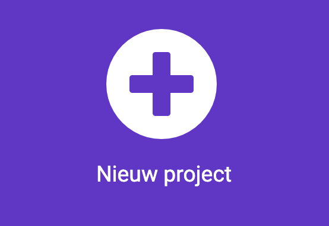

## Een eenvoudige melodie

Maak je eerste nummer!

\--- task ---

Open de MakeCode editor in [makecode.microbit.org](https://makecode.microbit.org){:target="_blank"}.

\--- /task ---

### Is dit je eerste micro:bit-project?

[[[makecode-tour]]]

\--- task ---

### Maak je project

Maak je project aan en geef het een naam:

Klik op de knop **Nieuw project**.



\--- /task ---

\--- task ---

Geef je nieuwe project een naam (bijvoorbeeld 'Onze Club') en klik op **Aanmaken**.

\--- /task ---

\--- task ---

### Maak een melodie

Sleep vanuit het menu `Muziek`{:class="microbitmusic"} het `speel melodie af ... met tempo 120 (bpm) [totdat het klaar is]`{:class="microbitmusic"} blok en plaats het binnen het `de hele tijd`{:class="microbitbasic"} blok.

```microbit
basic.forever(function () {
    music.play(music.stringPlayable("- - - - - - - - ", 120), music.PlaybackMode.UntilDone)
})
```

\--- /task ---

\--- task ---

Klik op de melodie om de Editor te openen.

\--- /task ---

\--- task ---

Ga naar de galerij en kies een melodie.

Bekijk het melodiepatroon in de editor.

\--- /task ---

\--- task ---

Klik op de afspeelknop ▶️ om de gekozen melodie te beluisteren.

Bekijk het melodiepatroon in de editor.

\--- /task ---

\--- task ---

### Luister en stem af

**Test**

- Probeer verschillende melodieën en hoor de veranderingen
- Verander de noten om de melodie te veranderen

\--- /task ---

\--- task ---

Blijf experimenteren tot je een melodie hoort die je bevalt.

\--- /task ---

\--- task ---

Als je een wijziging aanbrengt in een codeblok in het bewerkingspaneel zal de simulator opnieuw starten.

**Test**

- De melodie moet blijven spelen tot het einde (en dan in een lus terechtkomen vanwege het `de hele tijd`{:class="microbitbasic"} blok)

\--- /task ---
